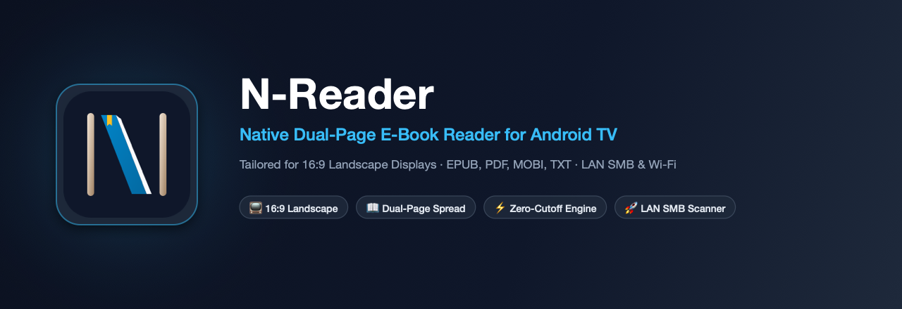
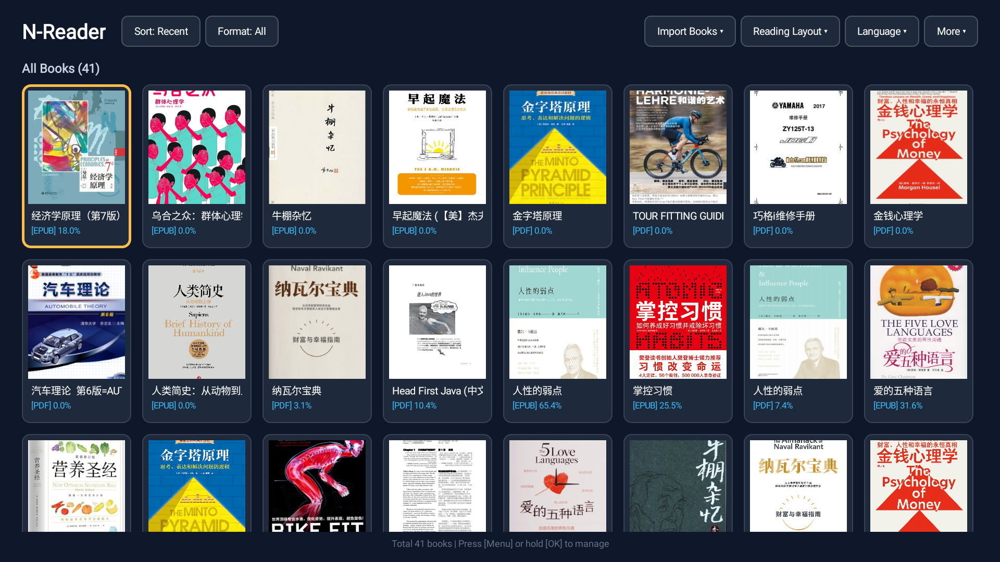
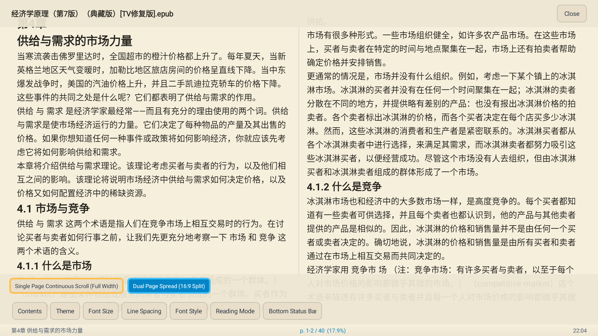
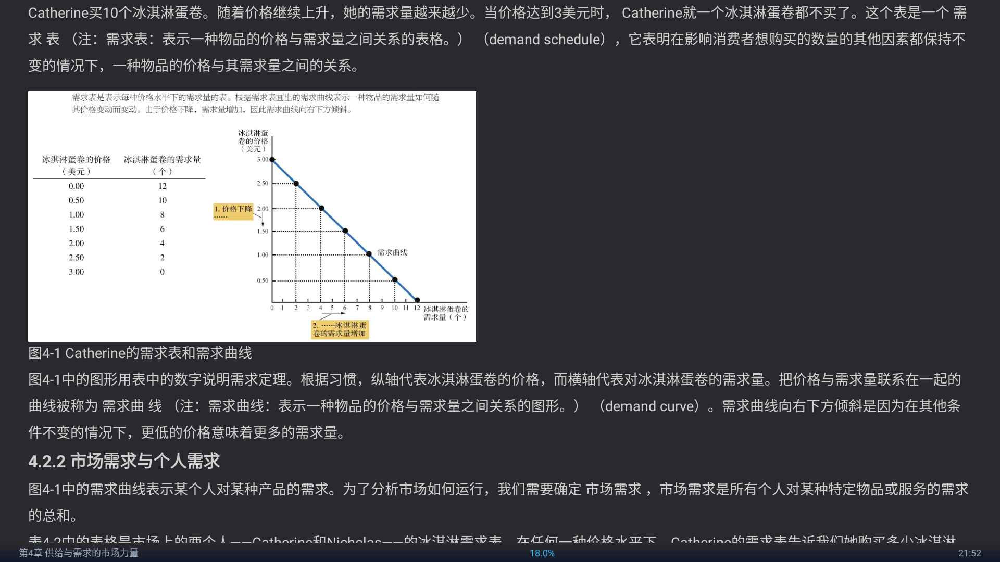

<p align="right">
  <b>English</b> | <a href="README_zh.md">简体中文</a>
</p>

<p align="center">
  
</p>

# N-Reader 📖

> **A native, distraction-free e-book reader crafted specifically for Android TV & smart displays (16:9 landscape).**

<p align="center">
  
</p>

<p align="center">
  
</p>

<p align="center">
  
</p>

---

## ✨ Key Features

- **📺 Tailored for 16:9 Landscape Big-Screen Displays**
  - **Dual-Page Spread Mode**: Expands wide 16:9 television screens into an authentic open hardcover book with a subtle center divider.
  - **Single-Column Continuous Scroll**: Smooth vertical reading experience when you prefer a vertical feed.
  - **Zero-Clipping Canvas Engine (`BookPageView`)**: High-performance custom View driven by authoritative single-pass `StaticLayout` line indices. Eliminates double-typesetting inflation, missing words, and truncated lines.
  - **Full-Bleed PDF Dual-Column Rendering**: Hardware-accelerated rasterization with center-spine alignment and zero wasted margins, turning PDF academic papers and manuals into comfortable wide spreads.

- **📚 Multi-Format Support**
  - Native parsing for **EPUB**, **PDF**, **MOBI**, **AZW**, **AZW3**, and **TXT** files.
  - **High-Definition Embedded Image & Chart Rendering**: Fully parses EPUB diagrams, mathematical curves, supply/demand charts, and inline footnote explanations (`[Note: ...]`).
  - Automatic cover extraction, reading percentage computation, and exact character-level reading position persistence.

- **📑 Rich Hierarchical Table of Contents (TOC)**
  - Preserves multi-level chapter trees (e.g. Chapter 1 ➔ 1.1 ➔ 1.2) without child nodes overwriting parent titles.
  - One-click jump to exact section anchors and page spreads.
  - **D-Pad Left/Right Fast Page-Flipping**: Jump 7-8 chapters per click for ultra-fast navigation across long book catalogues.

- **🚀 3 TV-Friendly Book Import Methods**
  1. **LAN SMB / NAS Import**: Automated 32-thread concurrent scanner discovering local SMB servers (port 445) in ~2 seconds, automatic share detection, and batch folder downloads.
  2. **Wi-Fi Web Transfer**: Scan a QR code or visit a local IP address from any phone, tablet, or PC browser to effortlessly push books to the TV.
  3. **Local Storage & USB Flash Drive**: Plug-and-play USB detection with batch folder import and multi-file selection.

- **🎨 Typography & Personalization**
  - **8 Hand-Crafted Themes**: Teal, Gray, White, Beige, Light Gray, Dark Gray, Pure Black, and Brown.
  - **4 Typography Styles**: System Sans, Classical Serif, Monospace, and Clean Medium.
  - Adjustable font size, line spacing, and auto-indent paragraph formatting.
  - Subnet/format filtering and 5 sorting modes (Recent Read, Title, Progress, Date Added, Size).

- **🎮 100% D-Pad Remote Optimized**
  - Intuitive remote navigation: single-click `OK` reveals menu directly focused on Table of Contents; double-click `OK` opens TOC instantly; Left/Right/Up/Down navigation; Return focus auto-anchoring to the last read book.

---

## 📥 Download & Installation

Grab the latest compiled APK from the [Releases](https://github.com/noby338/N-Reader/releases) page, or build it locally using Gradle.

```bash
# Clone the repository
git clone https://github.com/noby338/N-Reader.git
cd N-Reader

# Build debug APK
./gradlew assembleDebug

# Deploy directly to ~/Downloads (macOS convenience script)
./gradlew deployToDownloads
```

---

## 🛠️ Tech Stack & Architecture

- **Platform**: Android TV / Android 5.0+ (API 21~34)
- **Language**: Pure Native Java (zero cross-platform runtime overhead, ultra-low memory footprint on constrained TV hardware)
- **PDF Engine**: Android Native `PdfRenderer`
- **Networking**: `smbj` (SMB2/SMB3 protocol support) & Embedded NanoHTTPD Wi-Fi server
- **QR Code Generation**: ZXing Core

---

## 📄 License

This project is licensed under the [Apache License 2.0](LICENSE).
